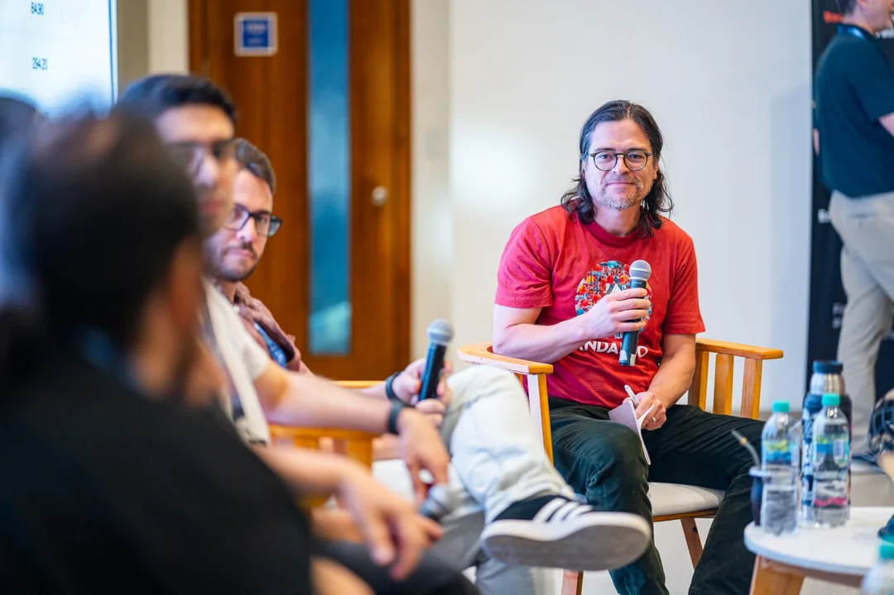
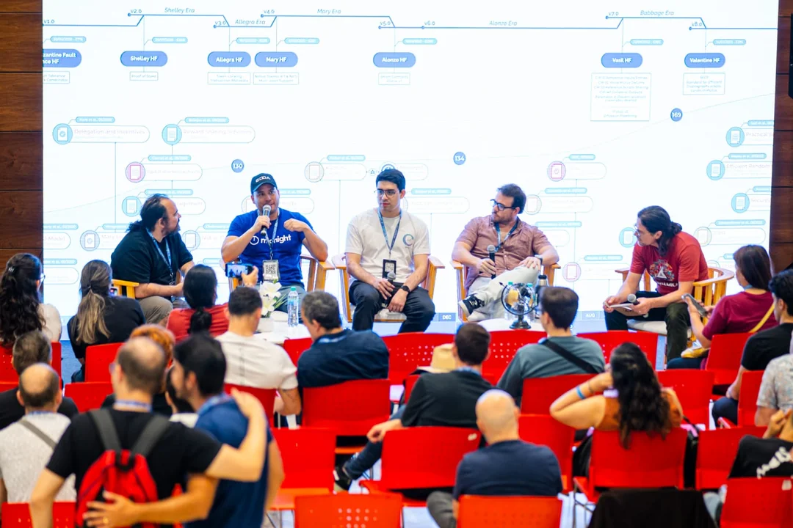
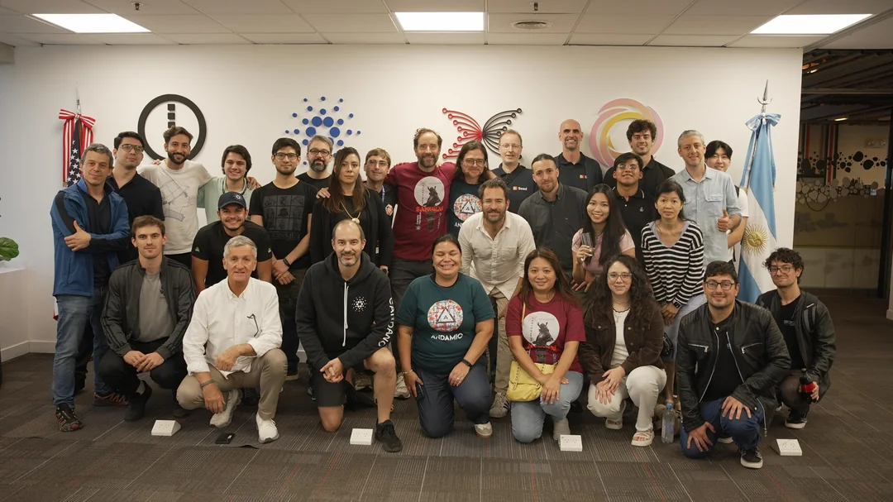

# Buenos Aires, 2025 — Being involved in as much altern events related to the main event as possible

## Where you were, and why

[Buenos Aires, Cardano Summit](https://techsummit.lat/#). I wanted to showcase my startup to the Cardano community and outsiders.

## What you faced

The organizers asked if I'd like to collaborate on hosting a talk with other founders. They also invited me to participate in a workshop the following day, where they're hoping to attract as many attendees as possible. 

## What to tell the next founder

Although it required extra effort, collaborating beyond the scope of my own stand helped increase the exposure of my startup's brand.

My recommendation: look for opportunities to actively support the event and its organizers. This kind of involvement can be a powerful, no-cost marketing and promotion strategy.

